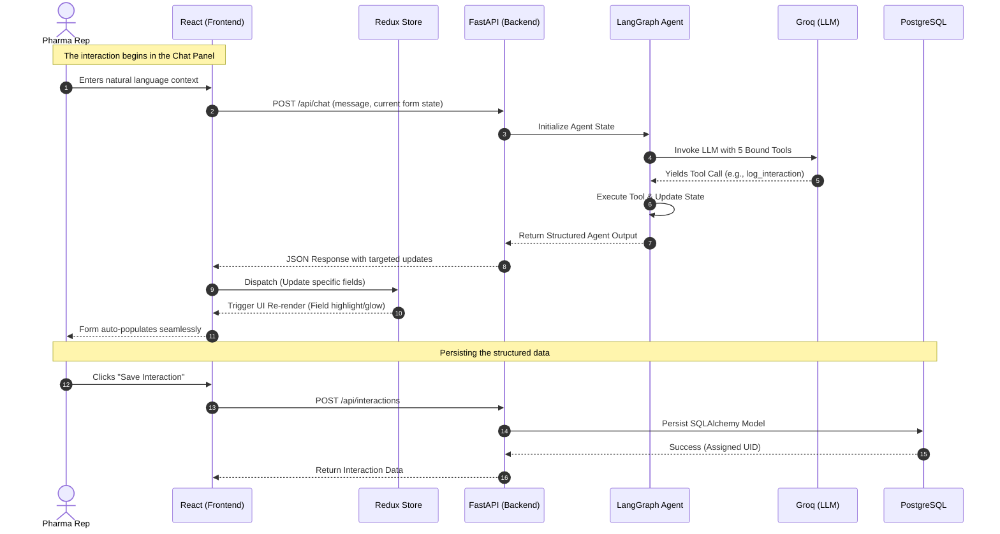

# AI-First CRM: Elite Pro Demo Script

This script is designed for a high-impact, professional presentation of the AI-First CRM HCP Interaction Module. It focuses on the architectural elegance, the paradigm shift from manual entry to AI-driven workflows, and the robust tech stack.

---

## 🏗️ System Architecture UML

---

## 🎤 The Presentation Script

### 1. The Hook (0:00 - 0:30)
**"Welcome, everyone.** 
Traditionally, pharmaceutical field reps spend an exorbitant amount of time doing data entry—typing out meeting notes, manually selecting drop-downs, and categorizing sentiment. It's friction. Today, I'm going to show you an architectural paradigm shift: an **AI-First CRM Module** where the user interface is completely driven by a deterministic language model workflow.

What you see here is a dual-pane architecture. On the left: our structured, read-only interaction form. On the right: our intelligent chat surface. The core philosophy here is simple: **Humans provide context; AI handles the structure.**"

### 2. The Demonstration (0:30 - 1:30)
*(Type a natural language prompt into the chat, e.g., 'Met Dr. Smith today, discussed Product X efficacy, positive sentiment, shared brochures.')*

**"Watch what happens when I input unstructured field notes.** 
The moment I hit send, we aren't just doing a standard LLM completion. The frontend packages the message along with the *entire current state* of the Redux store and ships it to our FastAPI backend. 

There, it hits a stateful **LangGraph agent**. The agent evaluates the input against 5 distinct tools and decides to invoke the `log_interaction` tool. It extracts the entities, normalizes the data, and returns a strictly typed JSON payload. 

Notice the UI on the left. The fields don't just snap into place—they glow. Redux catches the dispatched updates and surgically triggers re-renders only on the modified components. The rep did zero manual data entry."

### 3. The Toolchain & Edit Capability (1:30 - 2:30)
*(Type an edit command: 'Actually, change the sentiment to Negative and add a follow-up to call next week')*

**"Now, what about mutations?** 
If a rep makes a mistake, they don't hunt for a drop-down. They just tell the assistant. 
Because the agent has the current form state in its context window, it routes this request to the `edit_interaction` and `suggest_followup` tools. It knows exactly which fields to touch without overwriting the rest of the form. 

Our agentic layer is powered by **Groq running Llama 3.3 70B**, which gives us near-instantaneous token generation. We've also baked in a `search_hcp` tool for typo-aware entity resolution—if I misspell a doctor's name, the agent cross-references the database and auto-corrects it before it ever hits the UI."

### 4. Persistence & Architecture Summary (2:30 - 3:00)
*(Click Save Interaction)*

**"Finally, persistence.**
When we hit save, the structured data—which is already perfectly formatted by the LLM—is pushed through FastAPI to our PostgreSQL database via SQLAlchemy, generating an immutable `interaction_uid`. 

**In summary:** We've decoupled the data entry from the data structure. By leveraging React and Redux on the edge, and a robust LangGraph orchestration layer on the backend, we've transformed the CRM from a static repository into an active, intelligent assistant. 

Thank you. I'm happy to dive deeper into the code or answer any questions about the LangGraph implementation."
